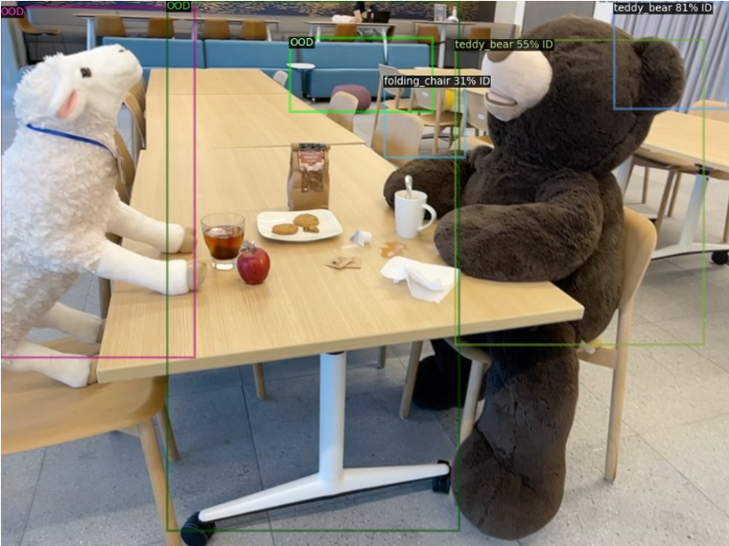
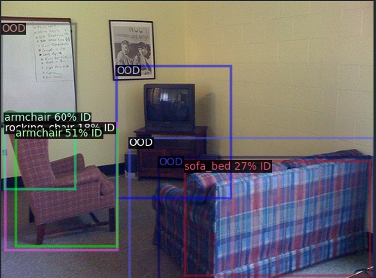

<div align=center>
<h1> Enhancing Out-of-Distribution Object Detection with CLIP </h1>
</div>

<div align=center>
<a src="https://img.shields.io/badge/%F0%9F%93%96-Report-red.svg?style=flat-square" href="https://docs.google.com/document/d/1k0BcnrnMjDZfE_vwAiLpe5KyqjaywVXNd_452LeZfjM/edit?usp=sharing">

</a>

<a src="https://img.shields.io/badge/%F0%9F%8E%A4-Slides-blue.svg?style=flat-square" href="https://brown365-my.sharepoint.com/:p:/g/personal/xma75_ad_brown_edu/EWl8KQBX871LmJq8Lz6NoHMBC3KXe2If3L-jqN38WdxD0w?e=iYzHeW&nav=eyJzSWQiOjI1N30">

</a>

</div>

<!-- <p align="center">
  <br/>
</p> -->


## :rocket: Introduction
In the field of artificial intelligence, one of the primary challenges is ensuring that models perform robustly under unexpected conditions. Traditional object detection models, such as Faster R-CNN, struggle with detecting __Out-Of-Distribution (OOD)__ data, often leading to incorrect detections or misclassifications. Inspired by [CLIPN](https://arxiv.org/abs/2308.12213), we developed the ***CLOUD***-Contrastive Learning Based Out-of-Distribution Unified Detector. This model applies OOD detection capability in multi-object detection scenarios.  

Our contribution includes:
- the creation of a new dataset
- the development of a joint training pipeline
- and the implementation of region-text matching techniques alongside new loss strategies to enhance overall model performance


## :cloud: CLOUD: Contrastive Learning based Out-of-distribution Unified Detector.
<p align="center">
  <br/>
</p>

## :hammer: Installation & Requirements
```shell
git clone https://github.com/Andy-wyx/cloud.git
cd cloud
conda create -n cloud python=3.9
conda activate cloud
pip install -r ./requirements.txt
conda install pytorch torchvision torchaudio cudatoolkit=11.3 -c pytorch
```
torch and cudatoolkit version may depend on your GPU Driver version. Refer to [this page](https://pytorch.org/get-started/previous-versions/) for previous versions.


## :computer:Prepare Dataset
* Step1: download coco dataset from [here](https://cocodataset.org/#download)
The expected structure is:
```
$coco/
  annotations/
  train2017/
  val2017
```
* Step2:Then run the python script to generate our dataset:
```shell
cd src/preprocess
python data_gen.py
```
* Step3: redefine dataset details in [./src/tuning_util.py](./src/tuning_util.py)

Side notes:
- train2017 is better for region-text matching
- val2017 is suitable for finetuning CLOUD with the feature distance loss. It is also faster for lightweight playing around.
- if you also want to try traditional OOD datasets e.g. iNaturalist, Textures, Places, SUN. See download instructions [here](https://github.com/deeplearning-wisc/large_scale_ood#out-of-distribution-dataset)

## :key:Pretrain & Inference
Pretrain by:
```shell
cd src
sh run.sh
```

You may need to adjust the parameters to fed in necessary parameters corresponding to the training you intend to conduct and the number of GPU devices you're using.

Inference (OOD detection network only) by:
```shell
cd src
python zero_shot_infer.py
```

Inference (CLOUD) by:
```shell
cd src
python zero_shot_infer_cloud.py
```

After these steps, the [./logs](./logs) folder will provide you with model checkpoints, inference results in csv and JSON file for further visualization.

## :star:Visualization
The main implementation of the visualizer is based on the detectron2 - we parse the json file first then visualize it.
<p align="center">
  
  <br/>
</p>


We also visualize our own RPN results here:
<p align="center">
  
</p>


## :book:Other Results & Future Work 
Refer to our [report](https://docs.google.com/document/d/1k0BcnrnMjDZfE_vwAiLpe5KyqjaywVXNd_452LeZfjM/edit?usp=sharing)

## :beers:Acknowledge
* [xmed-lab/CLIPN](https://github.com/xmed-lab/CLIPN)
* [detectron2](https://detectron2.readthedocs.io/en/latest/)
