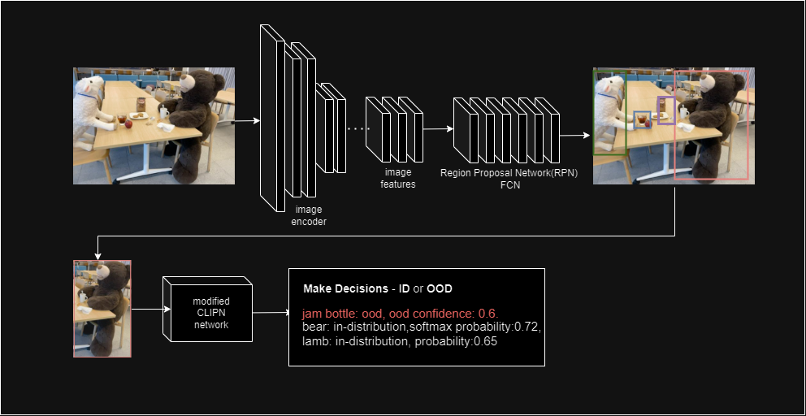
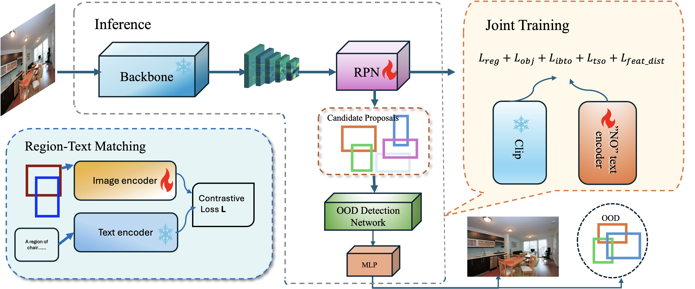

<h1> Enhancing Out-of-Distribution Object Detection with CLIP </h1>

<!-- 

   

 -->

## :rocket: Introduction
In the field of artificial intelligence, one of the primary challenges is ensuring that models perform robustly under unexpected conditions. Traditional object detection models, such as Faster R-CNN, struggle with detecting __Out-Of-Distribution (OOD)__ data, often leading to incorrect detections or misclassifications. Inspired by [CLIPN](https://arxiv.org/abs/2308.12213), we developed the ***CLOUD***-Contrastive Learning Based Out-of-Distribution Unified Detector. This model applies OOD detection capability in multi-object detection scenarios.  
Our contribution includes
- the creation of a new dataset
- the development of a joint training pipeline
- and the implementation of region-text matching techniques alongside new loss strategies to enhance overall model performance

## :cloud: CLOUD: Contrastive Learning based Out-of-distribution Unified Detector.

   

## Installation

## Prepare Dataset

## Ablation Experiments
Results: [ablation_results](https://drive.google.com/drive/folders/1dfPbZx8CwcK3-M88zTtgnMVG9VbzIrAW)
* Transform
* Loss
* Training strategy

## Training Results

## Visualization

## Future Work

**Acknowledge**
* [xmed-lab/CLIPN](https://github.com/xmed-lab/CLIPN)